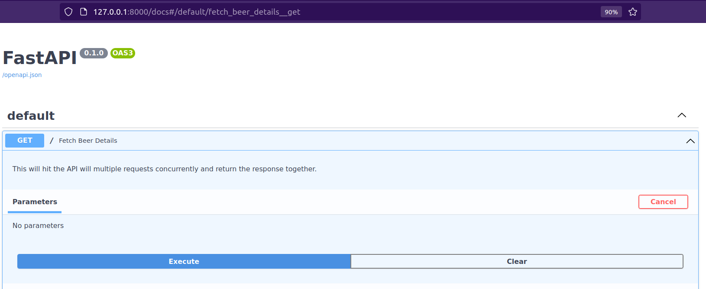
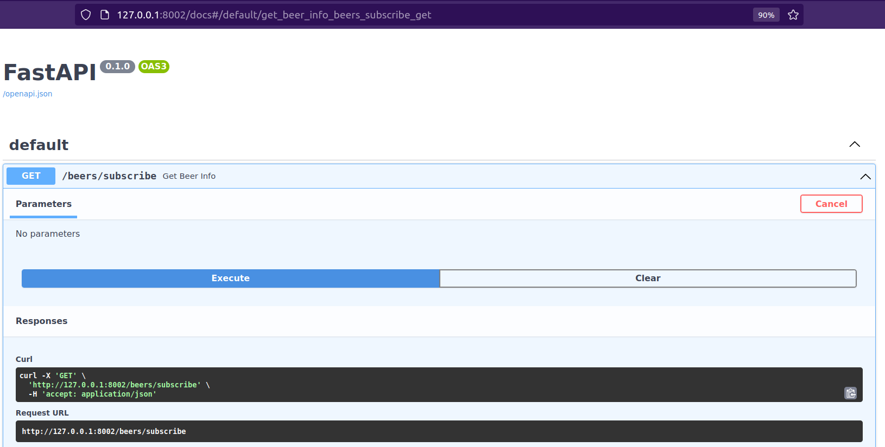

## PubSub Architecture using FastAPI and Redis

Introduction to PubSub or Event-driven architecture using Redis and FastAPI

## Workflow

1. Publisher tries to connect to external API leveraging the power of 
asynchronous and parallel processing and fetches the response.

2. The response is then published on the REDIS CHANNEL.

3. This response/message is then further fetched by the subscriber by subscribing the REDIS CHANNEL.

### Configuring the environment

Follow the below steps to configure the environment.

1. Install the poetry.  
   `pip install poetry`
2. Initialize poetry shell.  
   `poetry shell`
3. Install the dependencies.  
   `poetry install`

### Configuring the project

1. To configure the url, host and port numbers, copy the '.env.example' file.
2. Rename it to '.env'
3. Change the values with your required host and port numbers.

### Run the project

To run the api, use the following command.

    `sh run.sh`

### API Documentation

1. For the API documentation, copy the three urls into three separate tabs in the browser.
2. Append "/docs" to the end of each urls.
3. Click on "Try it Out" and then hit "Execute."

### Screenshots :

1. Beer Details API

2. Publisher API

3. Subsriber API

Once you hit the execute button, you will be able to see the messages getting printed on the terminal.

#### NOTE :
Since this is just an introduction to the implementation of Redis as a message broker. Feel free to use
this as a reference to expand your knowledge on the Event-Driven Architecture.

Happy Learning !!!
